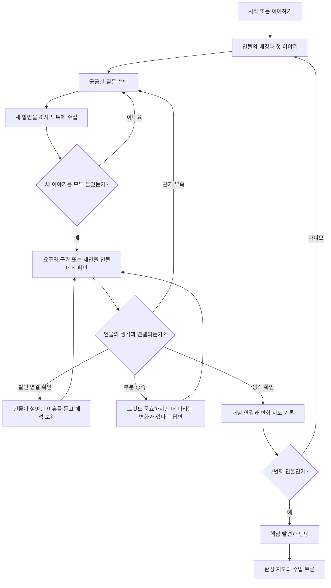
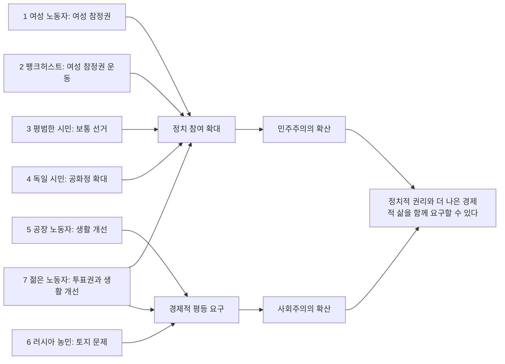
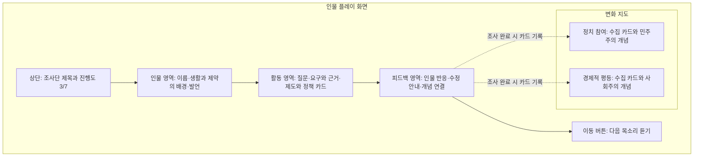
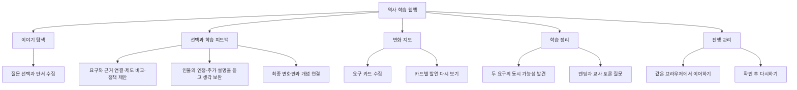
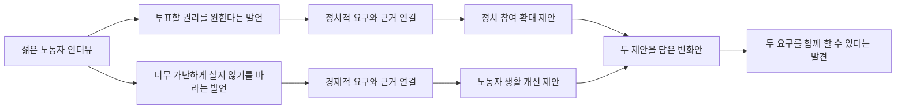
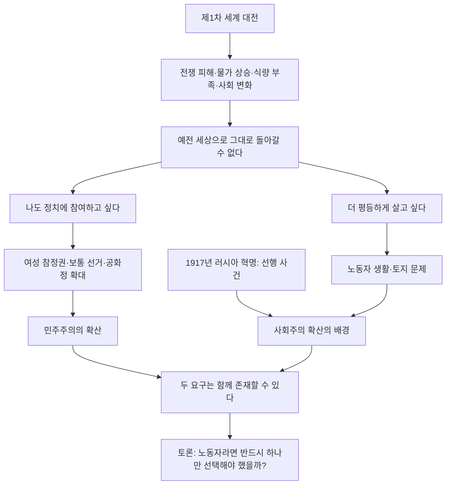

# 웹앱 이해를 위한 다이어그램

이 웹앱에서 학생은 7명의 이야기를 듣고 요구를 수집합니다. 정답을 맞혀 점수를 얻는 대신, 사람들이 원하는 변화를 두 영역의 지도에 모읍니다.

## 1. 학생이 보게 되는 화면 흐름

질문에는 정답이 없습니다. 첫 인물의 세 이야기를 모두 들으면 정리 버튼이 활성화됩니다. 학생이 버튼을 누르기 전까지는 마지막 답변을 계속 읽을 수 있습니다. 학생이 대화를 통해 단서를 얻고, 자신의 판단을 발언으로 뒷받침합니다. 처음 두 명은 조사 방법을 익히고, 다음 두 명은 제도를 비교하고, 그다음 두 명은 정책을 제안합니다. 마지막에는 두 요구를 함께 다루는 변화안을 만듭니다.

## 2. 7명의 목소리가 만드는 변화 지도

첫 정치 참여 카드를 얻으면 ‘민주주의의 확산’이 공개되고, 첫 경제적 평등 카드를 얻으면 ‘사회주의의 확산’이 공개됩니다. 마지막 인물의 카드는 양쪽에 연결되지만 수집한 인물 수는 한 명으로 계산합니다. 경제적 요구를 했다는 사실만으로 모든 인물이 사회주의자였다고 단정하지 않습니다.

## 3. 플레이 화면의 구성

PC에서는 지도와 이야기를 함께 볼 수 있습니다. 모바일에서는 지도 버튼으로 펼쳐 확인합니다. 다음 버튼은 조사 과제를 완료하고 인물의 반응을 읽은 뒤 사용할 수 있습니다.

## 4. 기능 구성

회원가입이나 성적표 없이 수업에서 바로 시작하는 구성이며, 교사는 마지막 질문을 활용해 학생의 이해를 확인합니다.

## 5. 마지막 변화안을 만드는 방식

한쪽만 제안하면 인물이 아직 다뤄지지 않은 요구를 이야기합니다. 두 요구와 각각의 근거·제안이 연결되면 완료됩니다. 하나의 정해진 정책 조합만 강요하지 않고, 근거에 맞는 타당한 조합을 허용합니다.

진행 기록에는 들은 질문, 모은 발언, 선택 중인 카드와 조사 완료 상태가 포함됩니다. 같은 브라우저에서는 새로고침 후 이어갈 수 있고, 저장이 차단되면 현재 탭에서 계속할 수 있습니다.

## 6. 엔딩에서 정리할 역사 흐름

공화정이 언제나 민주주의를 보장하는 것은 아니며, 나라별 변화의 시기와 범위도 다릅니다. 게임에서는 대표적인 사례를 통해 두 학습 축을 이해하게 합니다.
