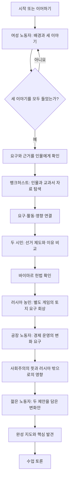
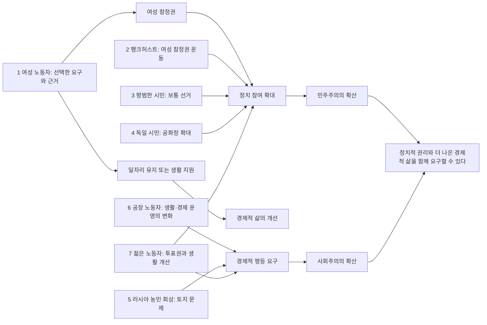
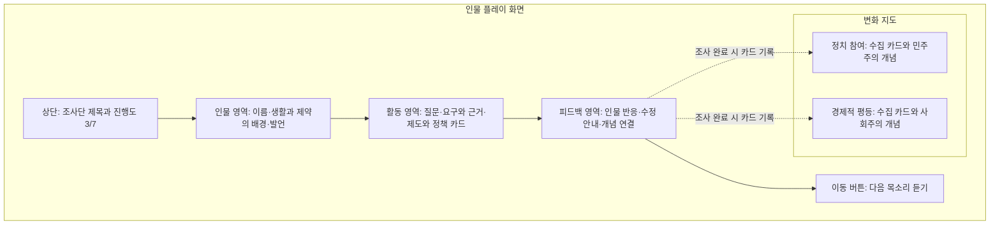
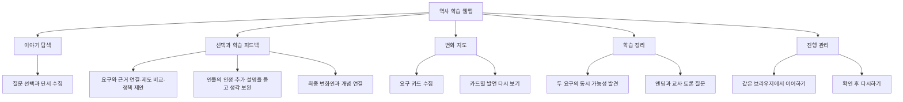
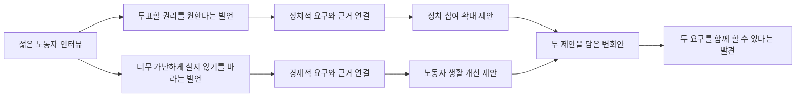
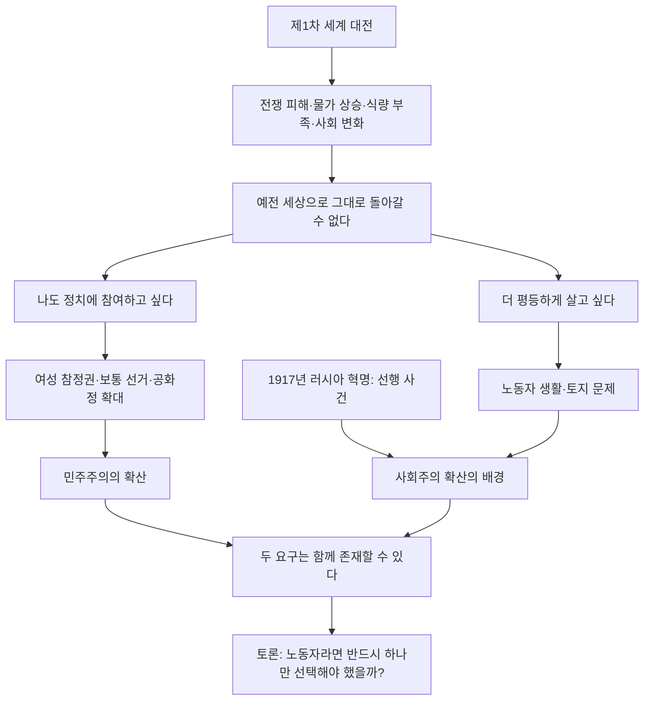
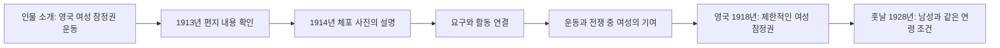
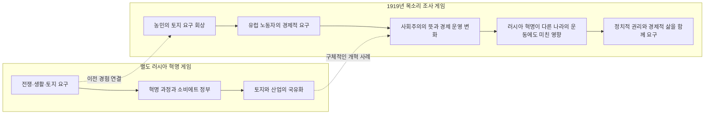
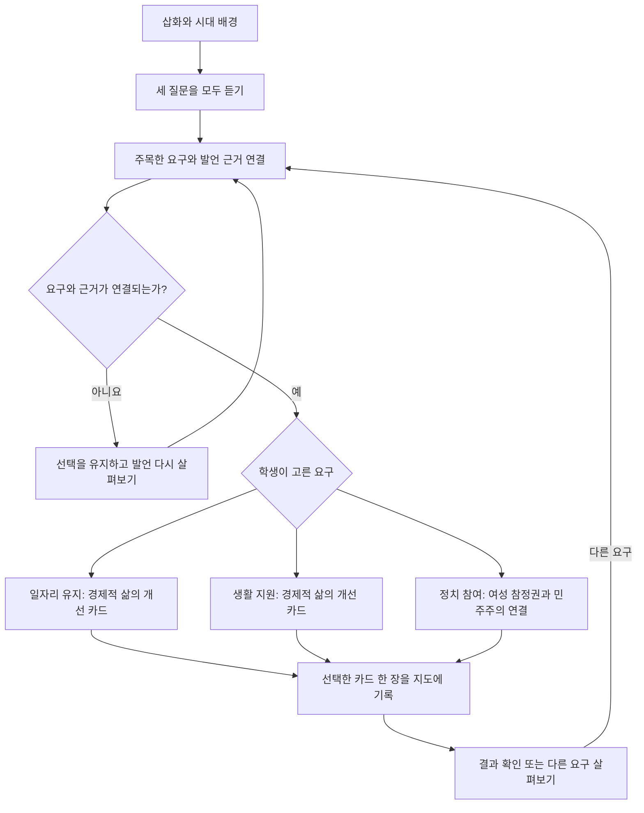

# 웹앱 이해를 위한 다이어그램

전체 계획에서는 학생이 7명의 이야기를 듣고 요구를 수집합니다. 현재 플레이 가능한 체험판은 여성 노동자 한 장면입니다. 정답을 맞혀 점수를 얻는 대신, 사람들이 원하는 변화를 두 영역의 지도에 모읍니다.

## 1. 확정한 전체 화면 흐름

7명의 목소리를 6개 장면에 담습니다. 첫 여성 노동자는 세 이야기를 모두 들은 뒤 정리 버튼을 누릅니다. 팽크허스트는 주요 자료 활동으로 충분히 다루고, 두 시민은 한 장면으로 묶습니다. 이후에는 회상·경제적 요구·변화안 구성으로 활동이 달라집니다. 본편 약 17분에 다시 읽기와 수정 여유를 더해 20분 이내로 설계합니다.

## 2. 7명의 목소리가 만드는 변화 지도

첫 정치 참여 카드를 얻으면 ‘민주주의의 확산’이 공개되고, 공장 노동자 장면에서 사회주의의 뜻과 영향을 살펴본 뒤 ‘사회주의의 확산’이 공개됩니다. 마지막 인물의 카드는 양쪽에 연결되지만 수집한 인물 수는 한 명으로 계산합니다. 경제적 요구를 했다는 사실만으로 모든 인물이 사회주의자였다고 단정하지 않습니다.

## 3. 플레이 화면의 구성

PC에서는 지도와 이야기를 함께 볼 수 있습니다. 모바일에서는 지도 버튼으로 펼쳐 확인합니다. 다음 버튼은 조사 과제를 완료하고 인물의 반응을 읽은 뒤 사용할 수 있습니다.

## 4. 기능 구성

회원가입이나 성적표 없이 수업에서 바로 시작하는 구성이며, 교사는 마지막 질문을 활용해 학생의 이해를 확인합니다.

## 5. 마지막 변화안을 만드는 방식

한쪽만 제안하면 인물이 아직 다뤄지지 않은 요구를 이야기합니다. 두 요구와 각각의 근거·제안이 연결되면 완료됩니다. 하나의 정해진 정책 조합만 강요하지 않고, 근거에 맞는 타당한 조합을 허용합니다.

진행 기록에는 들은 질문, 모은 발언, 선택 중인 카드와 조사 완료 상태가 포함됩니다. 같은 브라우저에서는 새로고침 후 이어갈 수 있고, 저장이 차단되면 현재 탭에서 계속할 수 있습니다.

## 6. 엔딩에서 정리할 역사 흐름

공화정이 언제나 민주주의를 보장하는 것은 아니며, 나라별 변화의 시기와 범위도 다릅니다. 게임에서는 대표적인 사례를 통해 두 학습 축을 이해하게 합니다.

## 7. 팽크허스트를 다루는 방식

교과서 187쪽의 자료를 바탕으로 누구인지·무엇을 했는지·어떤 변화에 기여했는지 살펴봅니다. 여성 참정권 확대를 한 사람만의 성과로 단정하지 않습니다.

## 8. 두 게임을 연결하는 방식

이전 게임의 저장 기록을 요구하지 않으며 러시아 혁명의 사건을 다시 플레이하지 않습니다. 사회주의는 혁명 이전부터 있었고, 생활 개선 요구를 한 사람이 모두 사회주의자는 아니라는 점을 구분합니다.

## 9. 현재 체험판의 선택 분기

경제적 요구를 곧바로 사회주의로 분류하지 않습니다. 선택을 바꾸면 첫 인물의 카드를 교체하며, 이후 인물로 넘어가는 기능은 아직 없습니다.
